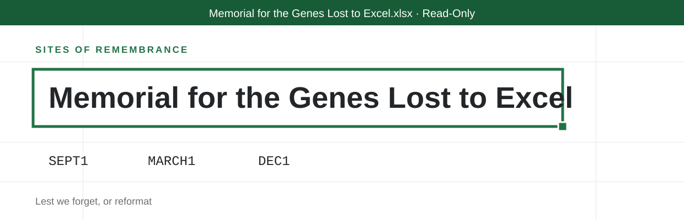

<p align="center">
  
</p>

<p align="center">
  <strong>In memory of the gene symbols converted to dates.</strong><br>
  And in honor of the scientists who, after two decades, chose the only winning move: surrender.
</p>

---

This repository contains the public site for the Memorial for the Genes
Lost to Excel (geneslosttoexcel.org, candidate domain, not yet purchased),
a site of remembrance for the 27 human gene symbols that the HUGO Gene
Nomenclature Committee renamed in 2020 because a default spreadsheet kept
reading them as dates.

## The Memorial

The wall carries the roll of the renamed: the fourteen SEPT symbols, read
as the first through fourteenth of September; the eleven MARCH symbols,
read as the first through eleventh of March; and DEC1, which fell alone
and is remembered alone. All now live under conversion-proof SEPTIN,
MARCHF, and DELEC names. Visitors are asked to observe a moment of
silence, formatted as General.

## What the checker actually does

The visitor service on the site is real, client-side, and factual. It
mimics default Excel conversion behavior against any identifier:

| Input shape | Fate |
| --- | --- |
| `SEPT1`, `MARCH-5`, `DEC1`, month-day forms | Converted to a date |
| `1-SEP` and other day-month forms | Converted to a date |
| `3/4`, `12-11` | Converted to a date and silently given the current year |
| `2310009E13` and other digits-E-digits identifiers | Converted to scientific notation |
| `007` and other leading-zero strings | Leading zeros removed on arrival |
| Digit strings of 16 or more characters | Rounded and exponentiated |
| `TRUE`, `FALSE` | Converted to a Boolean and made to work in logic |
| Anything else | Survivor; passes through unchanged |

## The history is real

The renaming happened. Zeeberg et al. documented the autoconversion
problem in 2004, Ziemann et al. found gene name errors in about a fifth of
genomics papers with Excel supplementary lists in 2016, Abeysooriya et al.
found the rate had risen to nearly a third in 2021, and the HGNC formally
renamed the vulnerable symbols in 2020. Excel gained a setting to disable
automatic conversion in 2023, roughly 36 years after launch. The memorial
records the response time without further comment.

---

## Development notes

The parody ends here. The rest of this file is accurate.

### Layout

A static, zero-build, zero-dependency site. Two HTML files and a handful
of generated images. There is no framework, no bundler and no
`package.json`. Cloudflare Pages serves the repository root exactly as it
appears here.

```
index.html            the site, wall and checker included
404.html              catch-all, served automatically by Cloudflare Pages
favicon.svg           icon source of truth (64px grid): a selected cell
favicon.ico           16/32/48, generated
apple-touch-icon.png  180x180, generated
og.png                1200x630 share image, generated
assets/logo.svg       wordmark, text outlined, used at the top of this README
tools/og.html         source for og.png
tools/logo-src.svg    source for assets/logo.svg, text still live
tools/favicon-16.svg  pixel-grid 16px icon, used for the smallest .ico entry
Makefile              asset regeneration only, never runs at deploy time
_headers              Cloudflare Pages header rules
robots.txt            permissive
wrangler.toml         Cloudflare Pages configuration
mise.toml             pins the Wrangler version used to deploy
```

The page makes zero requests to any external domain. Type is the system
sans, with a monospace stack for anything that would appear in a cell, so
there are no webfonts to host or wait for.

## The design

The memorial is held inside the thing that did the damage. The page is a
read-only worksheet: application chrome at the top, a formula bar reading
`9/1/2020 - what remains of SEPT1. No formula was involved.`, column
letters, and a sheet whose rows are real. Every block of text occupies a
whole number of 28px rows and every fallen symbol sits in its own cell, so
the roll of the renamed is a selected range rather than a picture of one.
The 27 names are cells; DEC1 is a single selected cell, because it fell
alone. Sheet tabs at the foot read Memorial, Sheet2 and DO NOT REFORMAT.

The row lattice is measured in a small inline script and re-measured on
resize; without it the sheet falls back to rows that grow to fit, so text
can never be clipped by a browser that skips the script.

### The production domain

The site is served at `genes.besteffortindustries.com`, and that is the host every absolute
URL on the page points at, so link previews resolve. `geneslosttoexcel.org` remains
the candidate domain and has not been purchased; if the site is
promoted, either to that domain or to a subdomain of the parent
(`genes.besteffortindustries.com`), the canonical host changes in the
places below and nothing else derives it:

| File | What to change |
| --- | --- |
| `index.html` | `rel=canonical`, `og:url`, `og:image`, `twitter:image` |
| `404.html` | nothing, the 404 uses only root-relative paths |
| `tools/og.html` | the domain printed in the footer of the share image |
| `README.md` | this table, and the mentions above it |

After changing `tools/og.html`, re-run `make og`.

### Local preview

```sh
make serve          # python3 -m http.server 8000
```

Then open `http://localhost:8000`. A local server is preferable to opening
the file directly because the icon paths are root-absolute.

### Regenerating images

Only needed when the wordmark, the icon or the share image changes.
Requires `google-chrome`, ImageMagick 7 (`magick`) and Inkscape on the
machine doing the regenerating; none of them is needed to deploy, because
the outputs are committed. The serif renders want a real Georgia on the
fontconfig path; this machine has one in `~/.local/share/fonts`.

```sh
make assets         # everything below
make og             # og.png     <- tools/og.html, via headless Chrome
make favicon        # favicon.ico + apple-touch-icon.png <- the SVG sources
make logo           # assets/logo.svg <- tools/logo-src.svg, text outlined
```

`make logo` outlines the wordmark's text so the README renders the same
whether or not the viewer has Georgia. Inkscape rewrites the whole file,
so the `GENERATED` comment at the top has to be pasted back afterwards.

### Deploying

Wrangler is configured via `wrangler.toml`, so a deploy is one command
from an authenticated shell:

```sh
make deploy         # wrangler pages deploy .
```

The Wrangler version is pinned by `mise.toml` (this machine manages its
Wrangler through [mise](https://mise.jdx.dev/); the global config tracks
`latest`, the repo pins an exact version). To move the pin, edit
`mise.toml`, run `mise install`, and deploy once to confirm nothing moved
underneath.

### Which Cloudflare account this deploys to

This machine has two Cloudflare identities, and picking the wrong one
deploys this site into an unrelated organisation.

**Pages configuration cannot pin the account.** `account_id` is a
Workers-only key; putting it in a Pages `wrangler.toml` makes Wrangler
refuse to run. So the account is selected by **an auth profile bound to
this directory**, recorded in
`~/.config/.wrangler/profiles/directory-bindings.json`:

```sh
wrangler auth activate personal    # already done; re-run after moving the repo
wrangler whoami                    # must print: Active profile: personal
```

Without a binding, Wrangler falls back to the `default` profile, which
here is the other organisation, and it will deploy there without asking.
**Check `whoami` before deploying.** The binding lives outside the repo,
so a fresh clone, a moved directory, or another machine all need
`wrangler auth activate` again.

One extra trap: Wrangler caches the resolved account in the untracked
`.wrangler/cache/wrangler-account.json` inside this directory. If a deploy
ever went to the wrong account from here, activating the right profile is
**not** enough; delete `.wrangler/` as well, or the cached account ID wins
and the API call fails with `Authentication error [code: 10000]`.

For CI, where profiles do not exist, set `CLOUDFLARE_ACCOUNT_ID` (the
account to deploy into) and `CLOUDFLARE_API_TOKEN` (credentials scoped to
it) as environment variables.

The Pages project is `geneslosttoexcel`, production branch `main`, with no
build command and the build output directory set to `/`. If you ever
recreate it from the dashboard, use exactly those values; there is nothing
to build, and any build command entered there will only make the
deployment worse.

To wire the Git integration instead, connect the
`holthe/genes-lost-to-excel` repository under **Workers & Pages -> Create
-> Pages -> Connect to Git** with the same settings. Note that the
repository name is hyphenated and the Pages project name is not; the
project name matches the domain.

### Custom domain

Deploy at least once first, so the project exists. Then, once
`geneslosttoexcel.org` (or whatever the site ends up on) is actually
registered:

1. **Add the zone to Cloudflare**, unless the domain was bought through
   Cloudflare, in which case it is already there. Dashboard -> **Add a
   site** -> the domain -> Free plan. Repoint the registrar's nameservers
   at the two Cloudflare ones and wait for the zone to go active.
2. **Attach the domain to the Pages project.** Dashboard -> **Workers &
   Pages** -> `geneslosttoexcel` -> **Custom domains** -> **Set up a
   custom domain**. Because the zone is on Cloudflare, the required CNAME
   record (apex, flattened, proxied, pointing at
   `genes.besteffortindustries.com`) is created for you. **Do not create the
   record by hand first**; a pre-existing CNAME blocks the flow outright.
3. **Repeat for `www`** if both should resolve.
4. **Wait for the certificate.** Issuance normally completes within a few
   minutes of the record appearing.

Until then the site is reachable at `genes.besteffortindustries.com`.

### Related

The memorial is maintained by
[Best Effort Industries](https://besteffortindustries.com) and is in
service in that register. Division numbers are assigned by the register
and are recorded nowhere else, including here; this site, of all sites,
knows what happens to identifiers that get copied into a second
document.

## License

Parody. The genes are real, the renaming is real, the spreadsheet is
real, and the memorial is the only thing here that is not.
